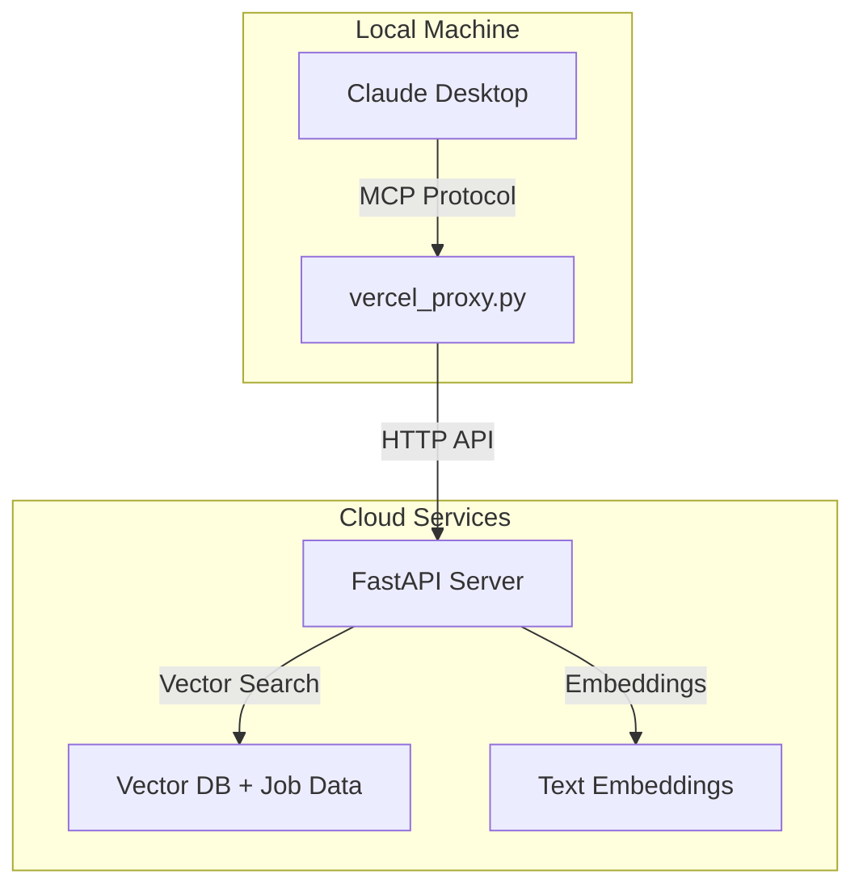

# 🏗️ **Project Overview: AI-Powered Job Description Generator**

## **What We're Building**
An AI-powered job description generator that uses **RAG (Retrieval-Augmented Generation)** to create high-quality job descriptions by learning from existing ones stored in a vector database.

## **Architecture & Services**



## **Services Used**

| Service | Purpose | Role |
|---------|---------|------|
| **Claude Desktop** | AI Assistant Interface | User interacts here to generate job descriptions |
| **Vercel** | Serverless Hosting | Hosts the FastAPI backend API |
| **Supabase** | Vector Database | Stores job descriptions with embeddings for similarity search |
| **OpenAI** | Text Embeddings | Converts text to vectors for semantic search |
| **MCP (Model Context Protocol)** | Tool Integration | Connects Claude Desktop to custom tools |

## **How It All Connects**

### **1. User Flow**
```
User in Claude Desktop → "Generate a Senior Frontend Engineer job description"
```

### **2. MCP Tool Chain**
```
Claude Desktop → MCP Protocol → Local Proxy → Vercel API → RAG Pipeline
```

### **3. RAG Generation Process**
1. **Query Processing**: User input (title, dept, requirements) → search query
2. **Embedding**: OpenAI converts query to vector embedding
3. **Vector Search**: Supabase finds similar job descriptions using `match_jobs()` function
4. **Content Extraction**: Extract patterns from similar jobs (responsibilities, requirements, etc.)
5. **Generation**: Combine patterns to create new job description
6. **Return**: Structured JSON response back through the chain

## **Key Files & Their Roles**

| File | Purpose |
|------|---------|
| `vercel_proxy.py` | Local MCP server that forwards requests to Vercel |
| `api.py` | Main FastAPI server with MCP protocol handler |
| `lib/generate.py` | RAG logic for extracting patterns from similar jobs |
| `lib/supabase.py` | Database interface for vector similarity search |
| `lib/embeddings.py` | OpenAI integration for text embeddings |

## **Why This Architecture?**

- **Scalable**: Vercel handles serverless scaling
- **Smart**: RAG ensures generated content is based on real job descriptions
- **Flexible**: MCP protocol allows easy integration with Claude Desktop
- **Fast**: Vector search enables semantic similarity matching
- **Maintainable**: Clean separation between proxy, API, and business logic

The system essentially turns Claude Desktop into a smart job description generator that learns from your existing job postings!
